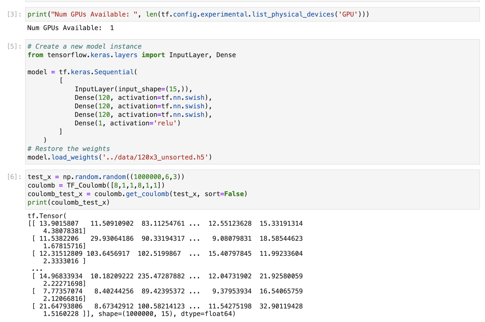
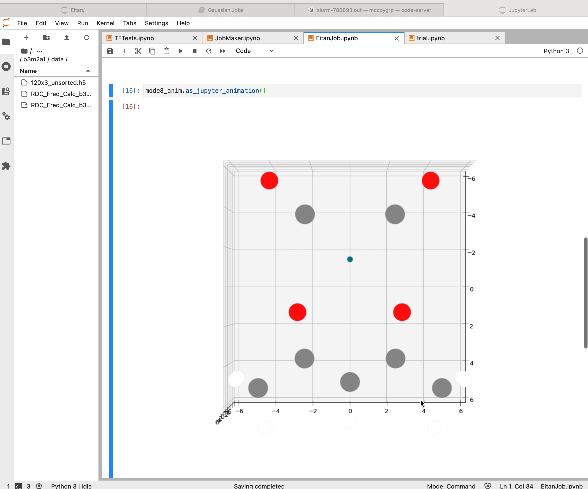

---
---

# McEnv

We've [talked about it before](https://mccoygroup.github.io/Notes/Misc/ContainerIDEs.html), 
so we're not going to re-argue why I think containers are useful.

Instead, we're just going to detail a little container we've set up to provide a consistent
environment in which to run things.
We're calling it [McEnv](https://github.com/McCoyGroup/McEnv) and it's generally a pretty
straight-forward thing to wrap your head around. 

To serve our current research, we wanted a few things
1. a modern version of python (3.8 or higher)
2. everything that come by default in Anaconda
3. GPU and MPI support (and MPI support in both flavors)
4. JupyterLab should be runnable in the container
5. a Fortran compiler

These requirements will evolve and as they do we can update the container.
As I'll demonstrate later on, we can also get GitHub to build out any number of 
variants of this container by simply creating a branch and doing some minor edits.

### TensorFlow Containers

Satisfying **1**, **4** and GPU support is almost embarassingly easy.
The people at TensorFlow have a huge array of different container builds to work off of.
You can read more about what they provide [here](https://www.tensorflow.org/install/docker).
For us, we can just use their `tensorflow/tensorflow:latest-gpu-jupyter` container as a starting point 
and that will bring GPU support, modern python support, and Jupyter support.
Dope.

### Anaconda

This was somewhat more annoying, but nothing bad either. 
There are any number of blog posts out there detailing how to put Anaconda in a Docker container.
We just tried different approaches until we found one that worked for us.

### MPI

This is the most involved part of the process. 
MPI comes in two flavors, [OpenMPI]() and [MPICH]().
I think this is a historical thing but it's super annoying.
Similarly annoyingly, there's no _de facto_ standard and when one uses `singularity` or `shifter`
the MPI build and version on the host system has to match the one inside. It's a whole thing.
It's also the closest we'll make it to dependency hell in container world, and we're
not even at the outer rim of the outermost level of dependency hell at this point.

In any case, we include support for _both_ of these and allow the specific version to be picked by un/commenting
when the container is built. This is a big place where we'll make use of branches to build the desired version.

```Dockerfile
## Open MPI Support
# pulled from /sw/singularity-images/testing/ngsolve-2.def
ARG MPI_VERSION=3.1.4
ARG MPI_MAJOR_VERSION=3.1
ARG MPI_URL="https://download.open-mpi.org/release/open-mpi/v${MPI_MAJOR_VERSION}/openmpi-${MPI_VERSION}.tar.bz2"
ARG MPI_DIR=/opt/ompi
RUN mkdir -p /tmp/ompi && \
    mkdir -p /opt && \
    # Download
    cd /tmp/ompi && wget -O openmpi-$MPI_VERSION.tar.bz2 $MPI_URL && tar -xjf openmpi-$MPI_VERSION.tar.bz2 && \
    # Compile and install
    cd /tmp/ompi/openmpi-$MPI_VERSION && ./configure --prefix=$MPI_DIR --disable-oshmem --enable-branch-probabilities && make -j12 install && \
    make clean


## MPICH Support
#ARG MPI_VERSION=3.2
#ARG MPI_MAJOR_VERSION=3.2
#ARG MPI_URL="https://www.mpich.org/static/downloads/${MPI_VERSION}/mpich-${MPI_VERSION}.tar.gz"
#ARG MPI_DIR=/opt/mpich
#RUN mkdir -p /tmp/mpi && \
#    mkdir -p /opt && \
#    # Download
#    cd /tmp/mpi && wget -O mpich-$MPI_VERSION.tar.gz $MPI_URL && tar -xjf mpich-$MPI_VERSION.tar.gz && \
#    # Compile and install
#    cd /tmp/mpi/mpich-$MPI_VERSION && ./configure --prefix=$MPI_DIR --disable-oshmem --enable-branch-probabilities && make -j12 install && \
#    make clean

ENV PATH=$MPI_DIR/bin:$PATH
ENV LD_LIBRARY_PATH=$MPI_DIR/lib:$LD_LIBRARY_PATH
```

We want to be able to use the `mpi4py` library, so with `mpi` built, we just install with `pip`

```Dockerfile
RUN pip install mpi4py --disable-pip-version-check
```

### Fortran

Conversely to MPI, `gfortran` is incredibly easy to include

```Dockerfile
RUN apt-get install -y gfortran && \
    apt-get clean
```


## Helper Scripts

This is all good and nice.
We can layer on just a bit more convenience by creating a bash script to set as the
`ENTRYPOINT` to the container.
I won't walk through everything involved. 
You can see what we did [here](https://github.com/McCoyGroup/McEnv/blob/main/CLI.sh).

Finally, we also create a little set of bash functions that can detect the environment
we're running in, bind any necessary paths to the container, etc.
This can be found [here](https://github.com/McCoyGroup/McEnv/blob/main/env.sh).

## End Result 

At the end of the day, we can use this to drive a JupyterLab instance as 
[detailed previously](https://mccoygroup.github.io/Notes/Misc/ContainerIDEs.html#jupyter).
It can also be used to support scripts, e.g.

```shell
#!/bin/bash
#SBATCH --output=test_HOD.out
#SBATCH --account=ilahie
#SBATCH --partition=ilahie
#SBATCH --mem=120GB
#SBATCH --ntasks-per-node=28
#SBATCH --chdir=/gscratch/ilahie/mccoygrp/people/b3m2a1/VPT2/test_config
#SBATCH --job-name=test_HOD

echo "Starting Job $SLURM_JOB_NAME"
START=$(date +%s.%N)
echo "  START: $(date)"
echo "    PWD: $PWD"
echo "  NODES: $SLURM_JOB_NUM_NODES"
echo "  PART.: $SLURM_JOB_PARTITION"
echo "=================================================="
echo "A simple job to test HOD with VPT2"
echo


. /gscratch/ilahie/mccoygrp/people/b3m2a1/b3m2a1_env.sh
mcenv --fulltb --script test_HOD.py
echo "=================================================="
END=$(date +%s.%N)
DIFF=$(echo "$END - $START" | bc)
echo "   END: $(date)"
echo "  TIME: $DIFF"
```

or run TensorFlow on GPU nodes

{:max-width="700px" width="100%"}

and, finally, it can help make sure that any code that runs locally runs on the HPC, too
like getting simple molecular animations

{:max-width="500px" width="100%"}


---
[Edit on GitHub](https://github.com/McCoyGroup/Notes/edit/master/Misc/McEnv.md)