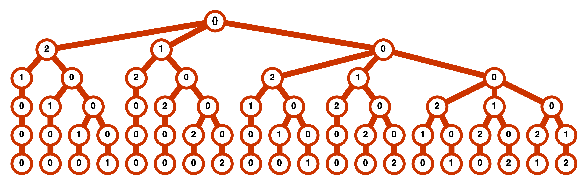
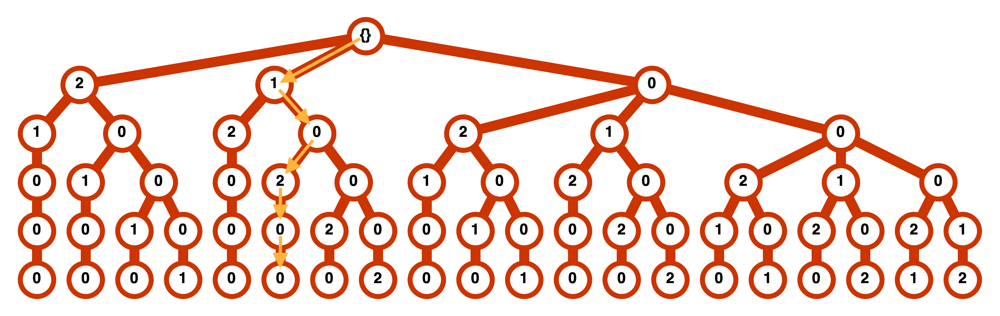

# Permutations & State Indexing

When working with normal modes bases, a common thing we do is talk about a state like 
"two quanta of excitation in the symmetric" stretch or "one quantum in the bend coupled to two quanta in the asymmetric stretch".
This is short-hand for a pair of basis functions.
Inspired by this, though, we can if we've got, say, 6 normal modes, we could write out a vector to describe a basis function, like

$$
b = (n_1, n_2, n_3, n_4, n_5, n_6)
$$

where each $n_i$ tells us how many quanta of excitation we have in mode $i$.

This actually ends up being a super useful computational tool, since for harmonic oscillator wave function bases we know how, e.g.
the $x^2$ operator can couple states with different numbers of quanta, and if we just hold things as vectors that allows us to cleanly
compute elements of the operator representation.

To actually build a representation, though, we also need to map each of these vectors onto some form of _index_.
Representation matrices are 2D objects, where each element looks like

$$
\left\langle n \right\lvert 
    O
\left\rvert  m \right\rangle
$$

for $n$ and $m$ some linearly ordered way to describe our basis elements.

So then the question becomes "how do we index a vector?"

### Array Indexing

The most straight-forward approach is to basically do what our base-10 number system does already, 
and say that we've got some max number of quanta possible in each mode, maybe 8, and then we can index this like

$$
(n_1, n_2, n_3, n_4, n_5, n_6) \rightarrow (n_1) 8^5 + (n_2) 8^4 + (n_3) 8^3 + (n_4) 8^2 + (n_5) 8^1 + (n_6) 8^0
$$

this is easy & fast & if we've got some max number of quanta is generally not a bad way to do things.

Unfortunately, these numbers can also get really big really fast.
If we think about, say, the neutral water tetramer, where we have 12 atoms and so 30 vibrational degrees of freedom,
when we try to index the state with 2 quanta of excitation in the highest-frequency mode and 1 quantum in
the second highest, we get

$$
(2, 1, 0, 0, 0, 0, ..., 0) \rightarrow 270799383593676935134183424
$$

which is a larger integer than `numpy` can store in its regular 64 bit integers.

Clearly, we are going to want a different approach.

### Permutation Indexing

The strategy we're going to take will be motivated by how we usually think about states.
There will be three layers of ordering, but the most important one is simply that
states are ordered first and foremost by their total number of quanta.

This alone will be sufficient to get us to high numbers of quanta of excitation.
We'll work through how to show that a bit later, but just as a note, for a 350 dimensional system (think like a 120 atom system)
counting _all_ of the states up with up to 10 total quanta of excitation we still have $9565143099796256561$ integers left
before we hit the max size of a 64 bit integer. Admittedly, by dimension 377 we'll run out of integers...but given that we've never
gone beyond 60 atoms in the group and usually stay below 20 I think we're probably safe.

Once we've decided that this is our primary sorting criterion we still need a way to order all of the states with the same number of
quanta in them.
The choice I made for this comes out of looking at [_integer partitions_](https://en.wikipedia.org/wiki/Partition_(number_theory)). 
An integer partition is just a way to split an integer, $N$, up into a set of (positive) integers ${n_i}$ that add up to $N$.
This is a standard combinatoric thing and efficient algorithms exist for calculating them, but the big reason this is of interest to
us is that when we say we have the state 

$$
(2, 1, 0, 0, 0, 0, ..., 0)
$$

this is just a padded version of one of the possible partitions of $3$.
Every single state, when written as a vector like this, can be sorted are related to an integer partition of its total number of quanta.
The question is then how we want to order these partitions. 
I opted to sort initially by length and then reverse-lexicographically.
For the integer partitions of $5$ this means we get

$$
(5) \\ 
(4,1) \\
(3,2) \\
(3,1,1) \\
(2,2,1) \\
(2,1,1,1) \\
(1,1,1,1,1) \\
$$

Other choices could be made. 
All choices will get us to a consistent ordering.

Finally, within a given partition, we have to decided how to sort states like

$$
(2, 1, 0, 0, 0, 0, ..., 0) \\
(0, 1, 0, 0, 2, 0, ..., 0) \\
(2, 0, 0, 0, 0, 0, ..., 1)
$$ 

This is definitely the most involved part of the sorting process, but it's not too nasty once you recognize how it works.
First off, we'll note that all of the states we had before are _permutations_ of one another, i.e. they all return the
same value when sorted.
So what need to do is order the _unique_ permutations of the sorted permutation.
To do this we build a tree describing how to get to each permutation successively. 
I've show this for the permutations of $(2, 1, 0, 0, 0)$ below

{:max-width="500px" width="100%"}

Then on this tree, to get to the permutation $(1, 0, 2, 0, 0)$ we'd walk through the tree like

{:max-width="500px" width="100%"}

and by counting the nodes to the left of that permutation we can see that it is in fact the 6th partition.

This is basically how we'll provide our 3rd ordering criterion. Now, we'll obviously employ a number of tricks to do this as quickly
as we can, in particular we'll exploit the fact that if we have vector of length $N$ with a set of unique elements $\{u_1, u_2, ..., u_d\}$ with
 corresponding multiplicities $\{n_1, n_2, ..., n_d\}$ we have
 
$$
numperms(N, \{n_1, n_2, ..., n_d\}) = \frac{N!}{\prod_{i} n_i!}
$$
 
This, plus a nice integer partitioning algorithm, is how I was able to basically instantly get the total number of states with 10 or fewer quanta
 of excitation at dimension 350.

We'll make use of this to skip walking through our entire permutation tree, as in fact all we'll need to do is figure out what _subtrees_ are to the left
of our target permutation, since we can use this formula to directly get the number of states in each subtree.

An implementation of all of this as well as an algorithm for _reversing_ the process is [here](https://github.com/McCoyGroup/Psience/blob/3bd778480196636e9b1fb0d4e262c046ee549c92/Psience/BasisReps/StateIndexers.py#L73).

---
[Edit on GitHub](https://github.com/McCoyGroup/Notes/edit/master/Misc/PermutationsStateIndexing.md)