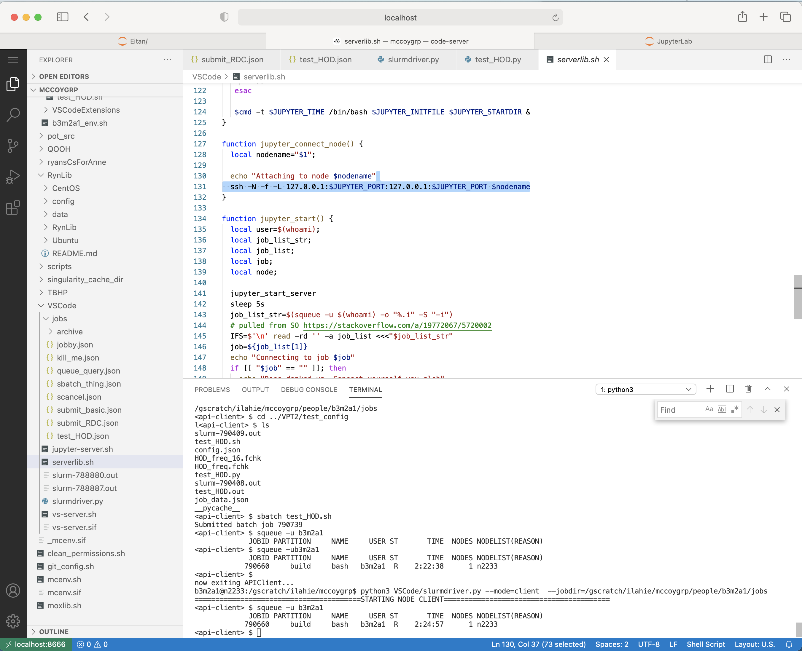
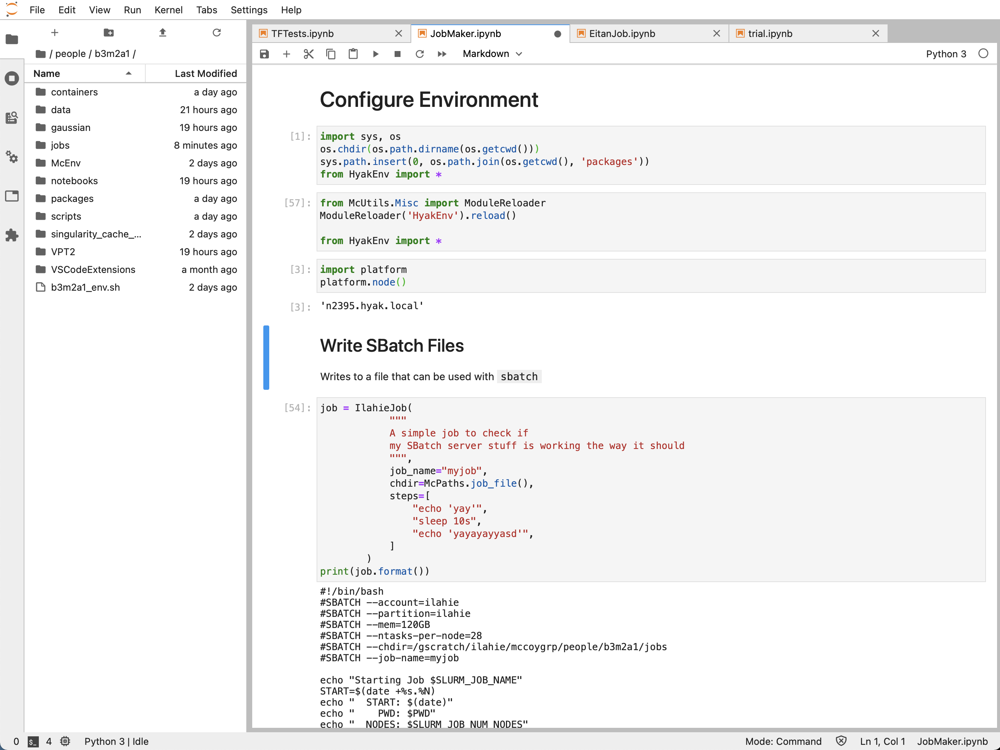

---
---

# IDEs in Containers

Containers, as managed by [Docker](https://www.docker.com/), [Singularity](https://sylabs.io/docs/), 
or [Shifter](https://docs.nersc.gov/development/shifter/how-to-use/) can dramatically simplify 
the process of porting code from one system to another. 
Conceptually, by being a minimal managed operating system that can run efficiently (enough) anywhere, 
many of the circles of [dependency hell](https://en.wikipedia.org/wiki/Dependency_hell) can be avoided.

This is particularly useful when running on HPC systems. 
Generally, one has to use a [`module` system](https://hpc-wiki.info/hpc/Modules) to manage dependencies.
One issue with this is that the set of modules on [Mox](https://wiki.cac.washington.edu/display/hyakusers/Hyak+mox+Overview) can differ from 
the set of module of [Cori](https://docs.nersc.gov/systems/cori/) and when [upgrades happen](https://www.nersc.gov/systems/perlmutter/) 
there are no assurances that everything will remain the same.
Moreover, the set of modules might be insufficient for what you want to do. 
One can try to get around this by using [conda environments](https://docs.conda.io/projects/conda/en/latest/user-guide/tasks/manage-environments.html),
but this still requires synchronization across platforms, and, not to put too fine a point on it,
once you're managing that kind of environment, you're half-way
to the container world anyway, but without any promises of portability.

Maybe all of that's convincing; maybe it's not. Regardless, we're going to present an example of how
containers can make life nice, specifically, getting [VS Code](https://github.com/cdr/code-server) to run on an HPC node with basically
0 effort using `singularity`.

## Basic Setup

Happily, initial configuration is trivial.
First, get onto your HPC. 
I use a [persistent connection](https://www.cyberciti.biz/faq/linux-unix-reuse-openssh-connection/) to avoid extra log ons. 
Especially in [2FA](https://authy.com/what-is-2fa/) world, this is nice.

```console
Mark$ MCDEFAULT_CONNECTION=~/.ssh/b3m2a1@mox.hyak.uw.edu 
Mark$ mcssh -h hyak
Last login: Thu Jan 14 18:19:10 2021
         __  __  _____  __  _  ___   ___   _  __
        |  \/  |/ _ \ \/ / | || \ \ / /_\ | |/ /
        | |\/| | (_) >  <  | __ |\ V / _ \| ' < 
        |_|  |_|\___/_/\_\ |_||_| |_/_/ \_\_|\_\

    This login node is meant for interacting with the job scheduler and 
    transferring data to and from Hyak. Please work by requesting an 
    interactive session on (or submitting batch jobs to) compute nodes.

    Visit the Hyak user wiki for more details:
    http://wiki.hyak.uw.edu/Hyak+mox+Overview

    Questions? E-mail help@uw.edu with "hyak" in the subject.

    Run "scontrol show res" to see any reservations in place that will 
    prevent your jobs from running with a "(ReqNodeNotAvail,*" error.

[b3m2a1@mox2 mccoygrp]$ 
```

Next, get a build node/interactive node/whatever your local HPC calls it.

```console
[b3m2a1@mox2 mccoygrp]$ build_node
srun: job 790748 queued and waiting for resources
srun: job 790748 has been allocated resources
[b3m2a1@n2233 mccoygrp]$ 
```

Now, we `module load singularity` to get it exposed (this is the only time we'll use the `module` system).
Then we just [`singularity build`](https://sylabs.io/guides/3.5/user-guide/build_a_container.html) 
the container from the [DockerHub repo that the developers provided](https://hub.docker.com/r/codercom/code-server)

```console
[b3m2a1@n2233 mccoygrp]$ singularity build code-server.sif docker://codercom/code-server:latest
INFO:    Starting build...
Getting image source signatures
Copying blob sha256:6c33745f49b41daad28b7b192c447938452ea4de9fe8c7cc3edf1433b1366946
 48.06 MiB / 48.06 MiB [====================================================] 0s
Copying blob sha256:164e2f04ea590ef419079d0a4d13e62ba04c48c0a269e270ac2d5d76b2e42ac6
 63.87 MiB / 63.87 MiB [====================================================] 1s
Copying blob sha256:2b9a6c0892dbfd0f9f3ab0d56b8ed20ac9abec558b22276b2c26036f4a773a7b
 842.51 KiB / 842.51 KiB [==================================================] 0s
Copying blob sha256:425135d0a4ab3f2b55e91cecf6834fbf5d10ae83165d86f31b6cff7c65c522f9
 4.12 KiB / 4.12 KiB [======================================================] 0s
Copying blob sha256:0ebec939099795da919a35a045bea5649dfc73d388d993664b35d05eb0a8e7ba
 2.20 MiB / 2.20 MiB [======================================================] 0s
Copying blob sha256:d581310c026e8471f757610673455c3255113f6e98d9340e1a72a50e0c89a5a3
...
INFO:    Creating SIF file...
INFO:    Build complete: code-server.sif
```

at this point we're 80% of the way there!

Now we need to get the server going and [exposing a port](http://www.linuxandubuntu.com/home/what-are-ports-how-to-find-open-ports-in-linux) 
so we can connect a browser to it.
That just means we need to `export` appropriate a `PORT` variable. This is up to you. I like `8666`

```console
[b3m2a1@n2233 mccoygrp]$ export PORT=8666
[b3m2a1@n2233 mccoygrp]$ singularity run /gscratch/ilahie/mccoygrp/VSCode/vs-server.sif
[2021-01-16T20:29:56.086Z] info  code-server 3.7.4 11f53784c58f68e7f4c5b3b8dae9407caa41725b
[2021-01-16T20:29:56.090Z] info  Using user-data-dir ~/.local/share/code-server
[2021-01-16T20:29:56.105Z] info  Using config file ~/.config/code-server/config.yaml
[2021-01-16T20:29:56.106Z] info  HTTP server listening on http://0.0.0.0:8666 
[2021-01-16T20:29:56.106Z] info    - Authentication is enabled
[2021-01-16T20:29:56.106Z] info      - Using password from ~/.config/code-server/config.yaml
[2021-01-16T20:29:56.106Z] info    - Not serving HTTPS
```

You'll note that the output said `Using password from ~/.config/code-server/config.yaml`.
You'll need to `cat` that file to get the password the first time you log on.

Now, midly annoyingly, we need to do two layers of [port forwarding]() to connect to the server that `VSCode` is running.
First, from our local machine we set up port forwarding to the HPC. I reuse my persistent connection. 
Then from a login node on our HPC we connect to the build node (or compute node, there are no restrictions beyond `singularity` running)
using the same port

```console
Mark$ mcportforward 8666 -h hyak
Mark$ mcssh -h hyak
[b3m2a1@mox2 mccoygrp]$ uqueue
    JOBID PARTITI                             NAME     USER ST       TIME  CPUS  NODES NODELIST(REASON)
   790660   build                             bash   b3m2a1  R    3:32:04     1      1 n2233
[b3m2a1@mox2 mccoygrp]$ VSCODE_PORT=8666
[b3m2a1@mox2 mccoygrp]$ VSCODE_NODENAME=n2233
[b3m2a1@mox2 mccoygrp]$ ssh -N -f -L 127.0.0.1:$VSCODE_PORT:127.0.0.1:$VSCODE_PORT VSCODE_NODENAME
```

Then by going to `http://localhost:8666` in whatever browser we like, we have a working VSCode instance!

{:max-width="700px" width="100%"}

### Simplifying the Workflow

Once we've gotten VSCode installed and have gotten it running at least once, it's possible to 
dramatically simplify the amount of work we need to do.
Just to give a quick preview, at least for Mac users, once we've set up a persistent connection
we'll be able to just double-click on icon on a local machine and directly open up a VSCode
instance running on the HPC.
Since getting this up and running, I've basically abandoned `vim` and do 90% of work through a
platform that's actually _designed_ for modern software development.

The first thing we'll need is a script that just starts a VSCode instance. Mine looks like

```shell 
#!/usr/bin/bash
# vs-server.sh
# Provides actual call into singularity to make this all happen

module load singularity

VSCODE_STARTDIR="$1"
VSCODE_PORT="$2"
VSCODE_PASSWORD="$3"

cd $VSCODE_STARTDIR

export PORT=$VSCODE_PORT
export PASSWORD=$VSCODE_PASSWORD
singularity run /gscratch/ilahie/mccoygrp/VSCode/vs-server.sif
```

You'll notice it's basically the same as what we did on the command line before.

Now we'll set up a little function that will request a node with `srun` and then call this script.
I set this up to run for a few different node types. 
You should obviously tailor it for your target use case.

```shell
VSCODE_PORT=8666
VSCODE_PASSWORD=""
VSCODE_NODE=build
VSCODE_TIME=8:00:00
VSCODE_STARTDIR=/gscratch/ilahie/mccoygrp/
VSCODE_INITFILE=/gscratch/ilahie/mccoygrp/VSCode/vs-server.sh
. /gscratch/ilahie/mccoygrp/moxlib.sh

function vscode_start_server() {
   local cmd;
   case $VSCODE_NODE in
      chem)
        cmd=chem_node_run
        ;;
      ilahie)
        cmd=ilahie_node_run
        ;;
      knl)
        cmd=knl_node_run
        ;;
      gpu)
        cmd=gpu_node_run
        ;;
      backfill)
        cmd=backfill_node_run
        ;;
      *)
        cmd=build_node_run
        ;;
   esac

   $cmd -t $VSCODE_TIME /bin/bash $VSCODE_INITFILE $VSCODE_STARTDIR $VSCODE_PORT $VSCODE_PASSWORD &
}
```

Then we can write a little function to connect to a node once we know the node name

```shell
function vscode_connect_node() {
  local nodename="$1";
  
  echo "Attaching to node $nodename"
  ssh -N -f -L 127.0.0.1:$VSCODE_PORT:127.0.0.1:$VSCODE_PORT $nodename

}
```

and one that, given a job ID will query `squeue` repeatedly until it knows what node the job is running on

```shell
function pull_job_node() {
  local job="$1";
  local iterations="$2";
  local max_iterations=10;
  local node_list_str;
  local node_list;
  local node;

  node_list_str=$(squeue -j $job -o "%.N")
  IFS=$'\n' read -rd '' -a node_list <<<"$node_list_str"
  node=${node_list[1]}
  if (($iterations<$max_iterations)) && [[ "$node" == "" ]]; then
    # recurse 
    iterations=$((iterations+1))
    sleep 1s
    node=$(pull_job_node $job 0)
  else
    echo $node
  fi
}
```

and finally we can string this all together into a little function that can be run from a login
node to start and connect to a VSCode instance

```shell
function vscode_start() {
  local user=$(whoami);
  local job_list_str;
  local job_list;
  local job;
  local node;

  vscode_start_server
  sleep 1s
  job_list_str=$(squeue -u $(whoami) -o "%.i" -S "-i")
  # pulled from SO https://stackoverflow.com/a/19772067/5720002
  IFS=$'\n' read -rd '' -a job_list <<<"$job_list_str"
  job=${job_list[1]}
  echo "Connecting to job $job"
  if [[ "$job" == "" ]]; then
    echo "Done donked up. Connect yourself you slob"
  else
    node=$(pull_job_node $job 0)
    if [[ "$node" == "" ]]; then
      # pause for 10 seconds then try again
      echo "No nodes for $job. Connect yourself you slob"
    else
      vscode_connect_node $node
    fi
  fi
}
```

This is all pretty slick. Finally, we can use our persistent `ssh` connection to write a script that will log on to
our HPC, run this function, attach to the login node, and open the appropriate location in the browser

```shell
#!/bin/bash

MCDEFAULT_CONNECTION=~/.ssh/b3m2a1@mox.hyak.uw.edu
mcportforward 8666 -h hyak
( sleep 1 ; open -a 'Safari' "http://localhost:8666" ) &
mcssh -h hyak << EOF
. VSCode/serverlib.sh
VSCODE_PORT=8666
vscode_start
EOF
```

Stick that in something like `VSCode.command` and at least on macOS, when you double click on the file, the script
will execute and you'll have VSCode running in your browser.

### Getting a Richer Runtime

One of the great things about containers is that they encourage and simplify incremental improvements to a runtime.
That is to say, if you want to package extra functionality in with the IDE so you can run stuff from the built-in
terminal, it's as easy as making a `Dockerfile` that looks like

```Dockerfile
FROM codr/code-server:latest

RUN pip install <whatever>
RUN ...
```

and things will "just work".

### Tunneling to the Node Terminal

The isolation that makes containers great can also be a bit of a drawback in certain types of interactive work.
Specifically, a common HPC workflow is to create a script that will run for a few hours or days over like 5 nodes,
then create a job file to submit using `sbatch`.
Having a nice IDE makes both creating the script and job file easy. 
Unfortunately, having the nice IDE running in a container means the container doesn't know about `sbatch` or really
much of anything about the host environment.
For the most part, this is as we want things, since that means the host environment can't leak in and mess up our
container runtime.
And yet, I still really wanted to be able to run things with `sbatch`, so I decided to take a page out of the
REST API world and create a very simple client/server structure so that I could submit requests from _inside_ the
container and have them processed _outside_ the container.
The entire set up, including boiler plate and CLI is ~500 LOC and took ~5 hours to write, just to 
drive home the point that this is nothing challenging. 
You can see what I set up [here](https://github.com/McCoyGroup/McEnv/blob/main/slurmdriver.py).
A more sophisticated or more robust interface could probably have been made using the python [xmlrpc](https://docs.python.org/3/library/xmlrpc.server.html)
library, and definitely there's some package out there which you could use for this if you wanted to go through the
work of getting it configured. I'm willing to bet you can also do some kind of port forwarding _into_ this container or something.
In any case, this was easy and worked for me, but I make no promises that it's optimal.

The idea is basically this. 
Before entering calling `vscode_start` we can initialize a request server like

```console
[b3m2a1@n2233 mccoygrp]$ python VSCode/slurmdriver.py --jobdir=/gscratch/ilahie/mccoygrp/people/b3m2a1/jobs
======================================== STARTING NODE DRIVER ========================================
```

This will look for requests files in the passed `jobdir` which will be formatted as JSON like

```json
{
  "status": "ready",
  "endpoint": ["sbatch"],
  "arguments": ["my_script.sh"]
}
```

which it will process, running things on a separate [`Thread`](https://docs.python.org/3/library/threading.html#threading.Thread)
so as to manage a `timeout` and whatnot, and return results in the same file like

```json
{
    "endpoint": "sbatch",
    "arguments": [
        "my_script.sh"
    ],
    "file": "/gscratch/ilahie/mccoygrp/people/b3m2a1/jobs/sbatch_5572416462835591801.json",
    "status": "error",
    "output": "sbatch: error: Unable to open file my_script.sh\n"
}
```

Next, inside the VSCode instance, when we want to communicate with this server we'll start a client like


```console
b3m2a1@n2233:/gscratch/ilahie/mccoygrp$ python3 VSCode/slurmdriver.py --mode=client  --jobdir=/gscratch/ilahie/mccoygrp/people/b3m2a1/jobs
========================================STARTING NODE CLIENT========================================
<api-client> $
```

which will take command line calls, parse them out, write a JSON request, and wait for a result.

In this way, we can do that `sbatch` call like

```console
<api-client> $ sbatch my_script.sh
ERROR (sbatch): sbatch: error: Unable to open file my_script.sh
```

which provides an emulation of a regular command line.

It's important to note that I explicitly chose to _not_ support arbitrary command line requests, because I only wanted to support what I knew
would work. To that effect, if you request something that doesn't work you get

```console
<api-client> $ rm -rf *
no endpoint rm; valid endpoints ['pwd', 'ls', 'cd', 'sbatch', 'squeue', 'sinfo', 'scancel', 'git', 'stop_server']
```

and if we `ls` we see that all is well

```console
<api-client> $ ls
QOOH
_mcenv.sif
archive
RynLib
clean_permissions.sh
...
mcenv.sif
VSCode
data
GoogleDrive
scripts
packages
```

## Jupyter

Everything I showed before can work _just as well_ if you have a container that can start a Jupyter server.
I made one that works for my purposes [here](https://github.com/McCoyGroup/McEnv).
If you set up the server to listen on `8899` you can make the same set of scripts as before and all will be
well in the world. 
Once you get that up and running, you can run JupyterLab in the browser with a double-click, which gives a
rich prototyping interface before you set up your `sbatch` jobs.

{:max-width="700px" width="100%"}

---
[Edit on GitHub](https://github.com/McCoyGroup/Notes/edit/gh-pages/notes/ContainerIDEs.md)